`2023-11-01 19:17:31`:

`2023-11-01 19:24:33`:
开发环境: 例如开发人员用到的自己的本地的数据库服务或者部署在服务器上的软件或服务.
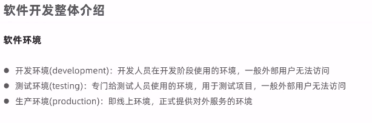

`2023-11-01 19:30:28`:
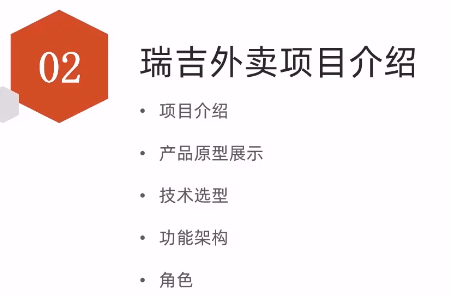
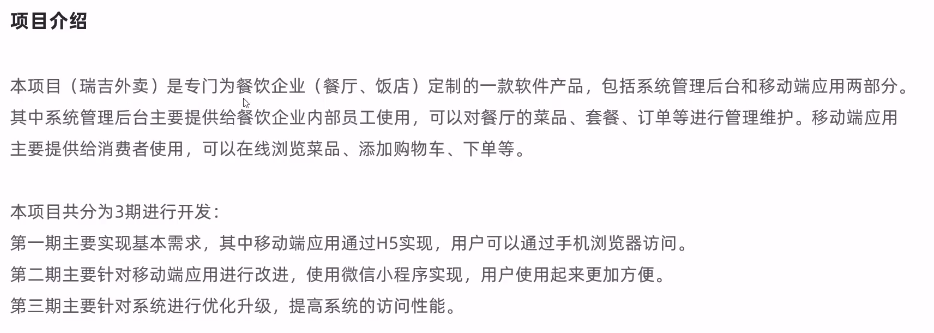
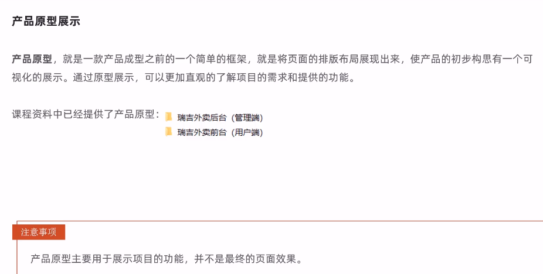

`2023-11-01 19:36:52`:
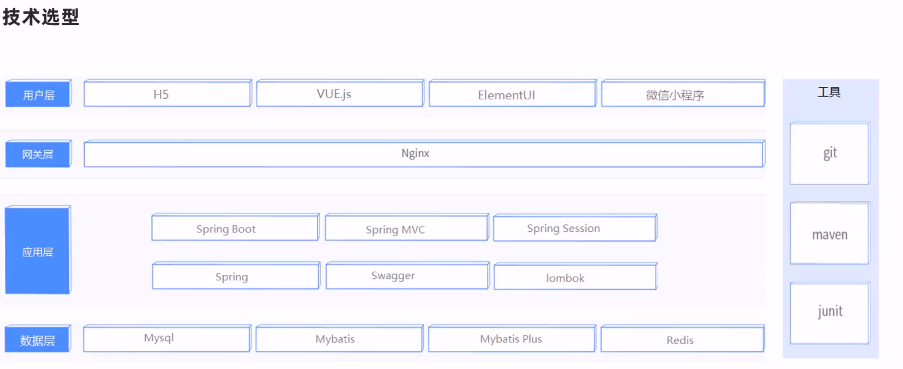

`2023-11-01 19:38:49`:
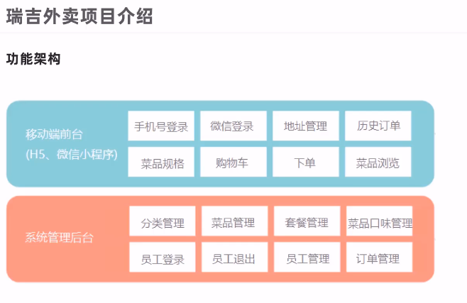

`2023-11-01 19:40:49`:
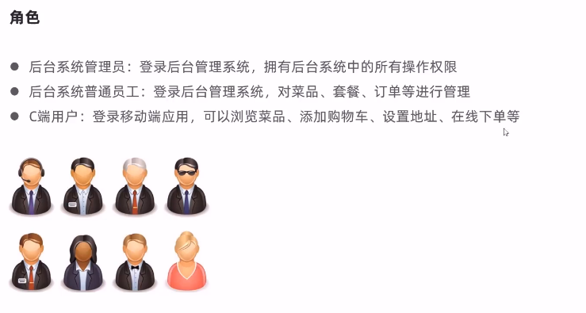

`2023-11-01 19:42:48`:
https://www.bilibili.com/video/BV13a411q753?p=5
建立数据库, 建立表结构
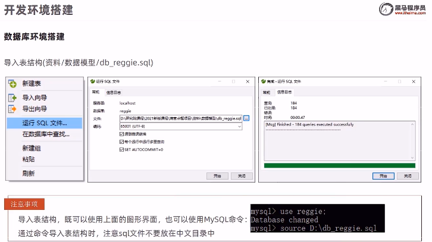
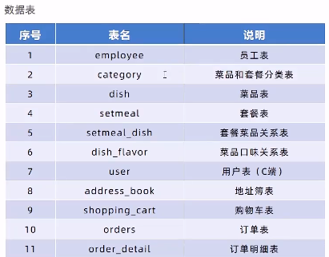

`2023-11-01 19:49:07`:
springboot 项目
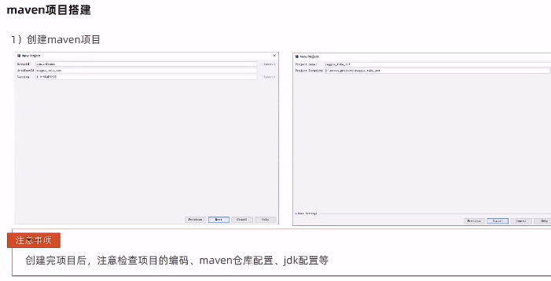
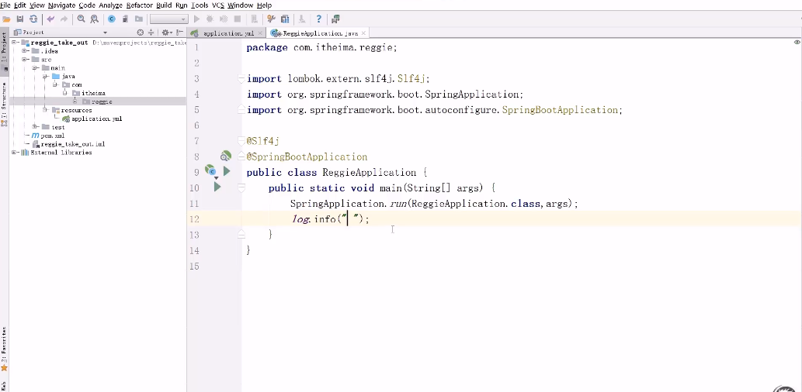

`2023-11-01 19:58:46`:
导入前端页面(直接复制文件夹到 resources 下)
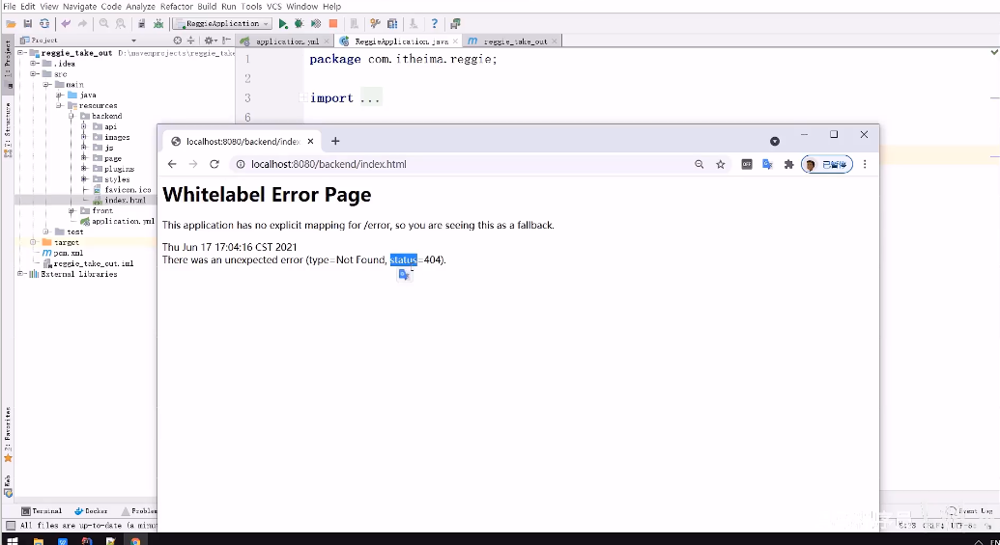

`2023-11-01 20:00:45`:
设置静态资源映射
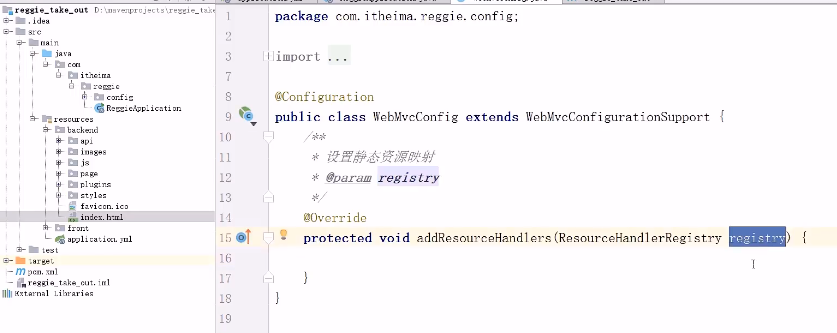
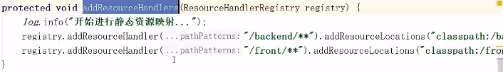

`2023-11-01 20:02:54`:
第一个功能, 登录功能.
先看看前端代码:
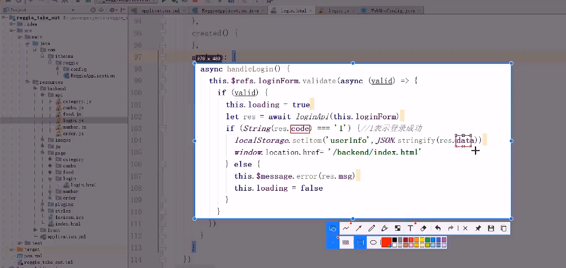
请求路径和方式是什么, 要返回什么数据?
(where is 接口文档?)

创建实体类和相应的包
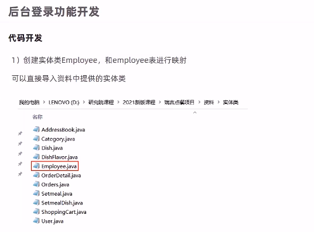
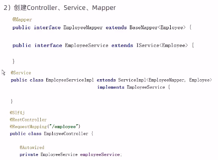

使用到了 MyBatisPlus 技术.

`2023-11-01 20:16:11`:
controller 层
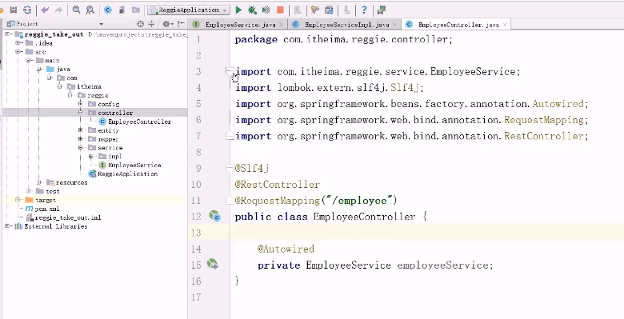 

`2023-11-01 20:20:19`:
创建一个通用的返回结果封装类.
登录请求:
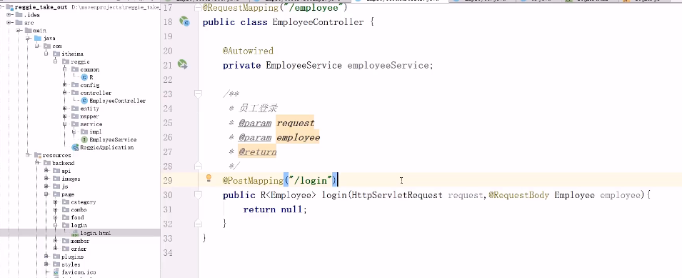

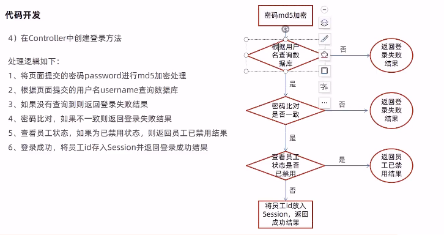

登陆成功存入会话 session.

